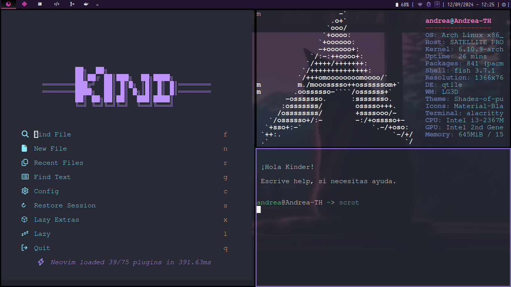
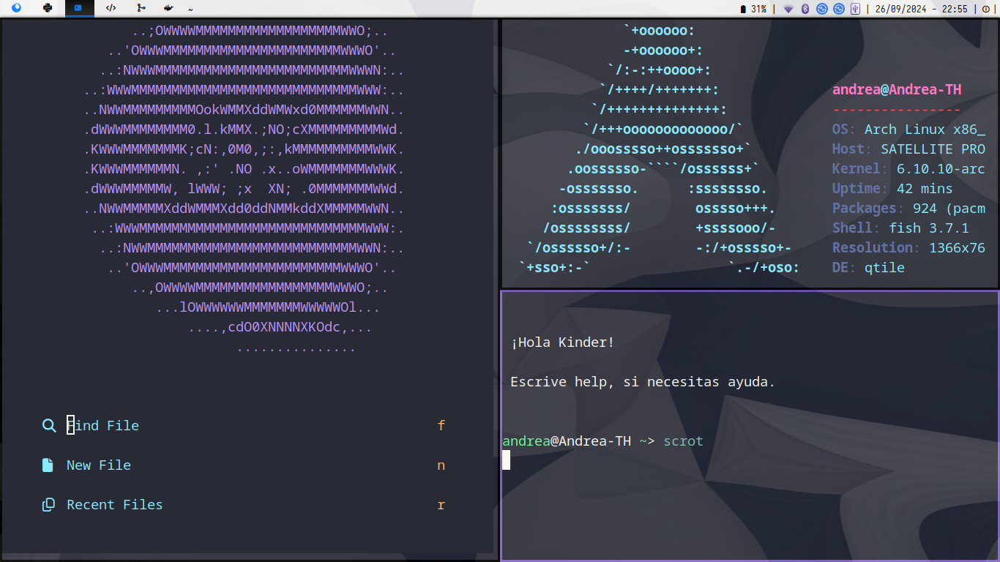

Español | [English](README-en.md)

# **Kinder.Dots**

Mi configuración personal de Arch Linux!

## **Mi Configuración de Arch Linux: Productividad y Elegancia:**

Este repositorio contiene mi configuración personalizada de Arch Linux, diseñada para un flujo de trabajo eficiente y un entorno visualmente atractivo. Combina herramientas poderosas y minimalistas para crear una experiencia de usuario fluida y agradable.

## **Componentes Clave:**

- **NVIM:** Editor de texto altamente configurable, mi herramienta principal para edición de código y texto.
- **Fish:** Shell intuitiva y moderna, con características que mejoran la productividad en la terminal.
- **Qtile:** Gestor de ventanas de mosaico, ofrece un control preciso sobre la disposición de las ventanas y un enfoque en el teclado.
- **Rofi:** Lanzador de aplicaciones y selector de ventanas, rápido y personalizable.
- **Alacritty:** Emulador de terminal veloz y con soporte para GPU.
- **Obsidian:** Aplicación para tomar notas y organizar conocimiento, basada en Markdown y enlaces.
- **Picom:** Compositor ligero para efectos visuales sutiles y agradables.
- **Oh My Fish:** Framework para personalizar y extender Fish con facilidad.

## **Capturas de Pantalla:**

### Configuración de escritorio 1:

### Configuración de escritorio 2:

## Fondos de Pantalla Personalizados:
### Configuración de escritorio 1:

### Configuración de escritorio 2:

## **Atajos de Teclado de Qtile:**

Los atajos de teclado en Qtile son fundamentales para una navegación eficiente. A continuación, se presentan los atajos de teclado más importantes para Qtile:

| **Atajo** | **Acción** |
| --- | --- |
| [mod] + h/j/k/l | Mover el foco entre ventanas |
| [mod] + [shift] + h/j/k/l | Mover ventana en el layout |
| [mod] + Return | Lanzar terminal |
| [mod] + w | Cerrar ventana enfocada |
| [mod] + f | Alternar pantalla completa |
| [mod] + m | Abrir menú de aplicaciones |
| [mod] + [control] + r | Recargar configuración |
| [mod] + (1-6) | Cambiar a grupo de trabajo |
| [mod] + [shift] + (1-6) | Mover ventana a grupo de trabajo |
## **Aplicaciones Esenciales:**

| **Aplicación** | **Descripción** | **Comando de instalación** |
| --- | --- | --- |
| Neovim | Editor de texto altamente configurable | `sudo pacman -S neovim` |
| Fish | Shell intuitiva y moderna | `sudo pacman -S fish` |
| Qtile | Gestor de ventanas de mosaico | `sudo pacman -S qtile` |
| Rofi | Lanzador de aplicaciones y selector de ventanas | `sudo pacman -S rofi` |
| Alacritty | Emulador de terminal veloz | `sudo pacman -S alacritty` |
| Obsidian | Aplicación para tomar notas y organizar conocimiento | `yay -S obsidian` |
| Picom | Compositor ligero para efectos visuales | `sudo pacman -S picom` |
| Visual Studio Code | Editor de código popular y extensible | `yay -S visual-studio-code-bin` |
| Dropbox | Servicio de almacenamiento en la nube | `yay -S dropbox` |
| Discord | Plataforma de comunicación por voz y texto | `sudo pacman -S discord` |
| Telegram Desktop | Cliente de mensajería instantánea | `sudo pacman -S telegram-desktop` |
| VLC | Reproductor multimedia versátil | `sudo pacman -S vlc` |
| Calibre | Gestor de libros electrónicos | `sudo pacman -S calibre` |
| Bitwarden | Gestor de contraseñas seguro | `yay -S bitwarden` |
| KDE Connect | Integración con dispositivos Android | `sudo pacman -S kdeconnect` |
| GIMP | Editor de imágenes avanzado | `sudo pacman -S gimp` |
| Firefox | Navegador web de código abierto | `sudo pacman -S firefox` |
| Nemo | Gestor de archivos moderno y funcional | `sudo pacman -S nemo` |

## **Instalación y Configuración:**

### Requisitos previos:

- Arch Linux instalado y actualizado.
- Git instalado.

### **Pasos:**

**1. Clonar el repositorio:**

```bash
git clone https://github.com/AndreaKinder/Kinder.Dots.git
```

**2. Instalar paquetes necesarios:**

```bash
# Navega al directorio del repositorio clonado
cd Kinder.Dots

# Otorga permisos de ejecución al script de instalación de paquetes de Pacman
chmod +x pacman-apps.sh

# Ejecuta el script para instalar aplicaciones desde Pacman
./pacman-apps.sh

# Otorga permisos de ejecución al script de instalación de paquetes de AUR
chmod +x aur-apps.sh

# Ejecuta el script para instalar aplicaciones desde AUR
./aur-apps.sh

# Otorga permisos de ejecución al script de configuración de Qtile
chmod +x setup_qtile.sh

# Ejecuta el script para configurar Qtile
./setup_qtile.sh
```

**3. Personalizar Temas:**

- **Instala el tema y los iconos:** `yay -S adapta-gtk-theme` y descarga los iconos [Material-Black-Plum-Suru](https://www.gnome-look.org/p/1333360).
- **Extrae los iconos**: `unzip Material-Black-Plum-Suru.zip` y muévelos: `sudo mv Material-Black-Plum-Suru /usr/share/icons`.
- Edita `~/.gtkrc-2.0 y ~/.config/gtk-3.0/settings.ini`: `gtk-theme-name = "Adapta-Nokto"` `gtk-icon-theme-name = "Material-Black-Plum-Suru"`
- **Opcional**: instala Kvantum para temas Qt: `sudo pacman -S kvantum-qt5` y ejecuta `echo "export QT_STYLE_OVERRIDE=kvantum" >> ~/.profile.`
- Reinicia sesión para aplicar los cambios.
- Si deseas personalizar `LightDM`, instala `lightdm-webkit2-greeter` y `lightdm-webkit-theme-aether`, y edita sus configuraciones. `sudo pacman -S lightdm-webkit2-greeteryay -S lightdm-webkit-theme-aether`
- Estas son las configuraciones que debes realizar:

```bash
# /etc/lightdm/lightdm.conf
[Seat:*]
# ...
# Descomenta esta línea y establece este valor
greeter-session = lightdm-webkit2-greeter
# ...

# /etc/lightdm/lightdm-webkit2-greeter.conf
[greeter]
# ...
webkit_theme = lightdm-webkit-theme-aether
```

- Para efectos visuales, instala picom y ejecútalo al inicio: `sudo pacman -S picom` y añade `picom &` a `~/.xprofile`.
- Si prefieres una interfaz gráfica, instala lxappearance: `sudo pacman -S lxappearance`.

### **Otras personalizaciones:**

**NVIM**: Ajusta la configuración en `~/.config/nvim/init.vim`.

```bash
# Cambia al directorio de Descargas
cd ~/Descargas

# Mueve los archivos de configuración de Neovim
# desde el directorio Kinder.Dots/Kinder.Vim/nvim/
# al directorio de configuración de Neovim del usuario
sudo mv Kinder.Dots/Kinder.Vim/nvim/* ~/.config/nvim/
```

**Fish**: Personaliza tu shell en `~/.config/fish/config.fish`.

```bash
# Cambia la shell predeterminada a Fish
chsh -s /usr/bin/fish

# Cambia al directorio de Descargas
cd ~/Descargas

# Mueve los archivos de configuración de Fish
# desde el directorio Kinder.Dots/Kinder.Fish/fish/
# al directorio de configuración de Fish del usuario
sudo mv Kinder.Dots/Kinder.Fish/fish/* ~/.config/fish/
```

**Qtile**: Modifica el comportamiento de Qtile en `~/.config/qtile/config.py`.

```bash
# Cambiar al directorio de Descargas
cd ~/Descargas

# Mover los archivos de configuración de Qtile
# desde el directorio Kinder.Dots/Kinder.Qtile/qtile/
# al directorio de configuración de Qtile del usuario
sudo mv Kinder.Dots/Kinder.Qtile/qtile/* ~/.config/qtile/
```

**Rofi**: Configura temas y comportamiento en `~/.config/rofi/config.rasi`. *Descargar [Temas de rofi](https://github.com/newmanls/rofi-themes-collection)*

```bash
# Clona el repositorio de temas de Rofi
git clone https://github.com/lr-tech/rofi-themes-collection.git

# Cambia al directorio del repositorio clonado
cd rofi-themes-collection

# Crea el directorio para los temas de Rofi si no existe
mkdir -p ~/.local/share/rofi/themes/

# Copia todos los temas al directorio de temas de Rofi
cp themes/* ~/.local/share/rofi/themes/
```

**Alacritty**: Personaliza la apariencia en `~/.config/alacritty/alacritty.yml`.

```bash
# Cambia al directorio de Descargas
cd ~/Descargas

# Mueve todos los archivos y directorios de la configuración de Alacritty
# desde el directorio Kinder.Dots/Kinder.Alacritty/
# al d
irectorio de configuración de Alacritty del usuario
sudo mv ~/Kinder.Dots/Kinder.Alacritty/* ~/.config/alacritty/
```

**Obsidian**: Genera los vaults y ajusta la configuración dentro de la aplicación.

```bash
# Crear el directorio principal para los vaults de Obsidian
mkdir ~/.vaults

# Crear subdirectorios para diferentes categorías de vaults
mkdir ~/.vaults/work    # Vault para trabajo
mkdir ~/.vaults/learn   # Vault para aprendizaje
mkdir ~/.vaults/personal # Vault para uso personal
```

**Oh My Fish**: Explora temas y plugins en el sitio web oficial.

```bash
# Clona el repositorio de Oh My Fish
git clone https://github.com/oh-my-fish/oh-my-fish

# Cambia al directorio del repositorio clonado
cd oh-my-fish

# Instala Oh My Fish en modo offline
bin/install --offline

# Descarga el script de instalación de Oh My Fish
curl https://raw.githubusercontent.com/oh-my-fish/oh-my-fish/master/bin/install > install

# Ejecuta el script de instalación en modo offline
fish install --offline=omf.tar.gz
```
